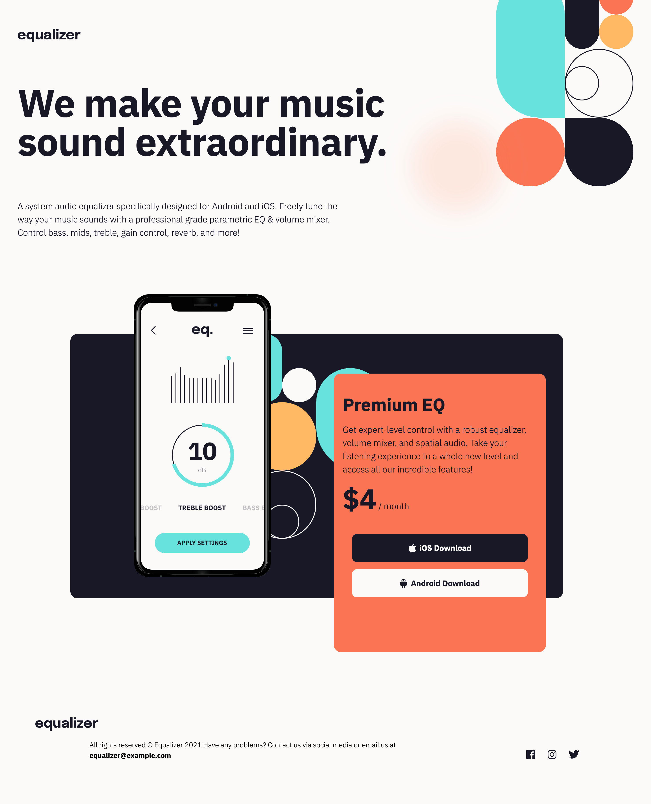

# Frontend Mentor - Equalizer landing page solution

This is a solution to the [Equalizer landing page challenge on Frontend Mentor](https://www.frontendmentor.io/challenges/equalizer-landing-page-7VJ4gp3DE). Frontend Mentor challenges help you improve your coding skills by building realistic projects.

## Table of contents

- [Overview](#overview)
  - [The challenge](#the-challenge)
  - [Screenshot](#screenshot)
  - [Links](#links)
- [My process](#my-process)
  - [Built with](#built-with)
  - [What I learned](#what-i-learned)
  - [Continued development](#continued-development)
- [Author](#author)

**Note: Delete this note and update the table of contents based on what sections you keep.**

## Overview

### The challenge

Users should be able to:

- View the optimal layout depending on their device's screen size
- See hover states for interactive elements

### Screenshot

### Links

- Solution URL: [Add solution URL here](https://your-solution-url.com)
- Live Site URL: [Add live site URL here](https://txubi.github.io/FEM-equalizer-landing/)

## My process

### Built with

- Semantic HTML5 markup
- CSS custom properties
- Flexbox
- Masking
- Mobile-first workflow

### What I learned

I learned that positioning items that are generated in CSS are a pain. SASS helps keeping my code organized. I had to use CSS masking to make the button's hover style to be correct.

### Continued development

Some of my code isn't Sassy becuase I thought that you couldn't use nesting inside a media query, so I will refactor that code.

## Author

- Website - [Jon Avila](https://www.jmavila.com)
- Frontend Mentor - [@txubi](https://www.frontendmentor.io/profile/txubi)
